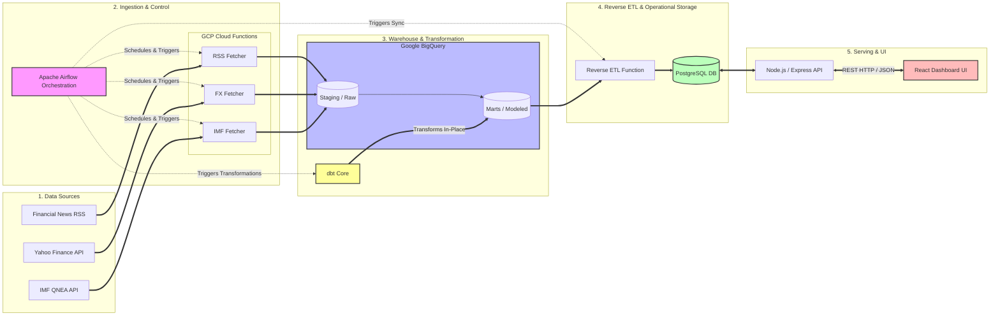

# End-to-End Financial & Macroeconomic Data Platform

An automated, end-to-end data platform designed to automatically ingest, model, and visualise global financial indicators, currency exchange fluctuations, and market-moving headlines. 

The system utilises an ELT (Extract, Load, Transform) architecture combined with a Reverse ETL sync loop. This architecture combines data warehousing with a transactional serving layer.

---

## Technical Stack & Infrastructure

*   **Orchestration:** Apache Airflow
*   **Ingestion Compute:** GCP Cloud Functions
*   **Data Warehouse:** Google BigQuery
*   **Data Transformation:** dbt
*   **Operational Storage:** PostgreSQL
*   **Backend API Gateway:** Node.js / Express
*   **Frontend UI:** React

---

## System Architecture & Data Flow



### 1. Ingestion Layer (EL)
Workflows are coordinated via an external **Apache Airflow** deployment. To ensure a highly modular system that is simple to modify, code dependencies are split into decoupled DAGs based on the natural upload cadences of the underlying data:
*   `hourly_news_dag`: Triggers a stateless GCP Cloud Function parsing financial RSS feeds.
*   `daily_fx_dag`: Triggers a cloud function pulling exchange data from the Yahoo Finance API.
*   `weekly_economics_dag`: Triggers a cloud function pulling macroeconomic metrics from the IMF QNEA endpoint.

The serverless ingestion functions process network calls asynchronously, gracefully capture upstream network errors, and append raw JSON/CSV data directly to landing tables in the warehouse.

### 2. Warehousing & Transformation Layer (T)
Raw extraction schema boundaries are preserved inside **Google BigQuery**. Transformations are managed entirely in-place by **dbt**, structured across isolated modular steps:
*   **Staging:** Cleans initial types, names columns safely, and casts raw schemas without touching downstream models.
*   **Intermediate:** Executes intensive operations like conditional text-based country keyword tagging and abstracting complex raw fields—such as the IMF's quarterly strings—using custom Jinja macros.
*   **Marts:** Formulates dimensional structures according to a pure Star Schema optimised for analytical operations, building structured fact layers (`fct_fx`, `fct_news`, `fct_economics`) backed by descriptive dimensional tables (`dim_countries`, `dim_currencies`, `dim_date`).

### 3. Operational Serving Loop (Reverse ETL)
Because analytical warehouses are not optimised for fast, concurrent transactional page reads over an app interface, a standalone **Reverse ETL Cloud Function** acts as a data sync channel. This function scans the analytical marts, isolates modifications, and upserts them down to a highly responsive, indexed **PostgreSQL** database.

### 4. Application API & Interface
An application layer built with **Node.js & Express** interfaces with the PostgreSQL instance. To guarantee system stability, strict validation middlewares evaluate requests at the controller gateway—forcing type and schema validation over all parameters (e.g., country strings, date boundaries, and pagination metrics) before interacting with the repositories. The authenticated JSON outputs are read directly by a responsive **React** dashboard client.

---

## Directory Structure

```text
├── .github/                  # CI/CD configurations
├── airflow/                  # Orchestration layer
│   └── dags/                 # Decoupled pipeline workflows (hourly, daily, weekly)
│       └── utils/            # Shared Airflow helper utilities
├── backend/                  # Transactional Node.js / Express API gateway
│   ├── src/controllers/      # HTTP request controllers and route boundaries
│   ├── src/middleware/       # Input validation engines (currency, country, pagination)
│   └── src/repositories/     # Isolated PostgreSQL database querying layers
├── dbt/                      # Data warehouse modelling frameworks
│   ├── macros/               # Reusable Jinja blocks (e.g., IMF date parsers)
│   ├── models/               # Staging, intermediate, and dimensional marts layers
│   └── seeds/                # Static lookup mappings (country codes, currency metadata)
├── frontend/                 # React UI Dashboard application
│   └── src/components/       # Modular chart, terminal, map, and grid primitives
└── functions/                # Serverless Ingestion & Reverse ETL scripts
    ├── rss/                  # RSS parsers
    ├── yahoo_fx/             # Yahoo Finance trackers
    ├── imf_qnea/             # IMF QNEA stream processors
    └── reverse_etl/          # Warehousing-to-Postgres synchronization engine
```